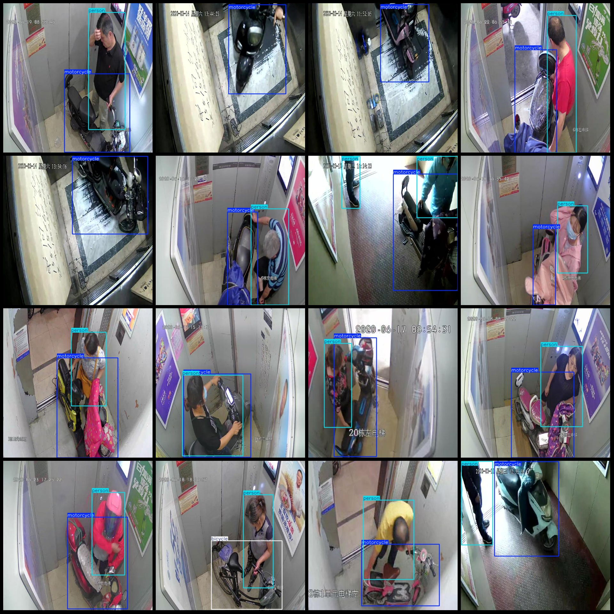

# Electric Bike Detection Dataset for Entry into Elevators in VOC+YOLO format with 7106 images and 3 categories

The dataset format: Pascal VOC format + YOLO format (without split path in the .txt file, only containing jpg images and corresponding VOC format xml files and YOLO format txt files)
Number of images (number of jpg files): 7106
Number of annotations (number of xml files): 7106
Number of annotations (number of txt files): 7106
Number of categories: 3
Repository: firc-dataset
Label name order for each category in the annotation files (Note that the order in the yolov2/classes.txt does not correspond to this, but rather follows the labelImg annotation rules): ["bicycle", "motorcycle", "person"]
Total number of boxes per category:
bicycle = 489
motorcycle = 5881
person = 8224
Total number of boxes = 14594
Image resolution: 640x640
Annotation tool used: labelImg
Annotation rules: draw bounding boxes for categories
Important note: No  
Special statement: This dataset does not guarantee the accuracy of the trained model or weight files  
Image preview:
## Image

Here is a pay link on Stripe ( https://buy.stripe.com/3cs8yP7sY87d0vu9AB ). Please contact me lonlonago@foxmail.com after funding $89, and I will send you a complete data files , thank you!

